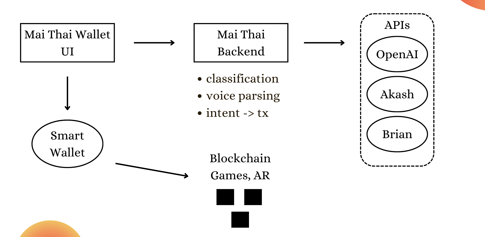

# Mai Thai Wallet
“Just as the Mai Tai evokes feelings of relaxation and adventure, 
your wallet can aim to make blockchain interactions feel less intimidating 
and more inviting, especially for beginners.”

## Introduction

Mai Thai Wallet aims to make blockchain interactions as seamless and enjoyable as sipping a perfectly crafted cocktail. Users can effortlessly chat or even speak with the wallet to transfer or swap tokens, check balances, and more-all without needing prior blockchain experience. Designed with inclusivity in mind, Mai Thai is a trusted companion for users with visual impairments and a seamless fit for augmented reality and gaming applications, offering a cutting-edge yet accessible experience that prioritizes usability and innovation.

## Key Features
**Seamless Interaction:** Users can effortlessly communicate with their wallet using voice commands or a chat-based interface, enabling them to express their intents naturally and intuitively.

**AI Agents:** Mai Thai leverages advanced intelligent systems to analyze and classify user intents, seamlessly converting them into precise blockchain transactions.

**Smart Wallet:** Empowers users to generate a new wallet secured by a pass key, offering a robust self-custody solution. Leveraging account abstraction, it supports advanced features like transaction bundling, gas sponsorship, and seamless automation, enhancing both convenience and user control.

## Architecture

### Technologies
- **[Omi](https://www.omi.me/)** - using omi device we record voice intents from users and parse them to textual format
- [CDP Smart Wallet](https://docs.cdp.coinbase.com/) - Smart account with passkey login and account abstraction feature like transaction bundling and gas sponsoring
- [Vercel AI SDK](https://sdk.vercel.ai/) - used to interact with different AI engines and streaming text results to the UI
- [Brian API](https://docs.brianknows.org/brian-api/apis) - executing ERC20 swap intents
- [Akash API](https://chatapi.akash.network/) - using Llama3 deployed on Akash for generating text responses to users
- [Blockscout API](https://docs.blockscout.com/devs/apis) - verifying token addresses, getting ABI arrays of the tokens, retrieving token lists

## Getting Started
1. Setup env variables `copy .env.example .env`
2. Run application locally `yarn dev`
3. Open [http://localhost:3000](http://localhost:3000) with your browser, and start interacting with the wallet 

## Future Work

We plan to integrate more features in the future, such as: 

- **Voice recognition security** - ensuring that only owner can communicate with the wallet, preventing malicious behaviour
- **Cross-chain support** - enable cross-chain execution of user intents
- **Mobile application** - creating mobile application or omi app extension, enhancing user experience when chatting with the wallet 
