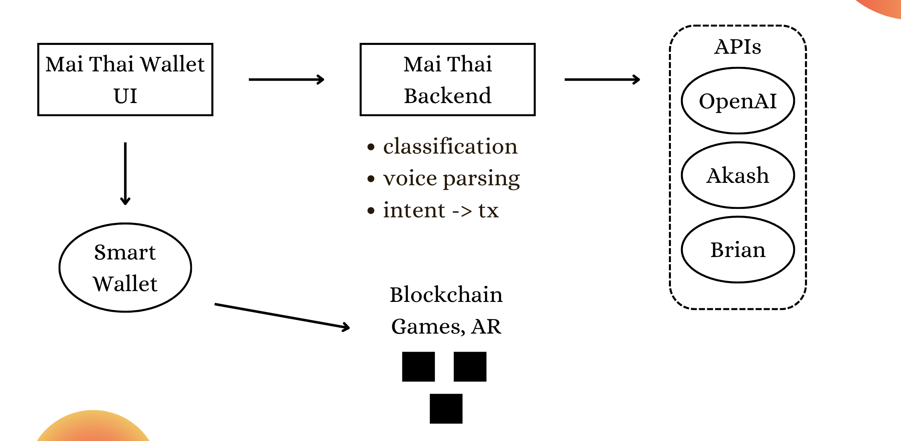

# Mai Thai Wallet
"Just as the Mai Tai evokes feelings of relaxation and adventure, 
your wallet can aim to make blockchain interactions feel less intimidating 
and more inviting, especially for beginners."

## Introduction

Mai Thai Wallet aims to make blockchain interactions as seamless and enjoyable as sipping a perfectly crafted cocktail. Users can effortlessly chat or even speak with the wallet to transfer or swap tokens, check balances, and more-all without needing prior blockchain experience. Designed with inclusivity in mind, Mai Thai is a trusted companion for users with visual impairments and a seamless fit for augmented reality and gaming applications, offering a cutting-edge yet accessible experience that prioritizes usability and innovation.

## Key Features
**Seamless Interaction:** Users can effortlessly communicate with their wallet using voice commands or a chat-based interface, enabling them to express their intents naturally and intuitively.

**AI Agents:** Mai Thai leverages advanced intelligent systems to analyze and classify user intents, seamlessly converting them into precise blockchain transactions.

**Crossmint Wallet Integration:** Mai Thai integrates with the Crossmint Wallet, providing a secure and user-friendly self-custody solution. Users can easily create and manage their wallets within the Mai Thai interface.

**Transaction Verification:** One of the standout features of Mai Thai is the transaction verification step. Before an agent executes a transaction, a popup window appears, allowing the user to review the transaction details. The user must explicitly approve the transaction by clicking the execute button, ensuring transparency and control over their funds. This concept sets Mai Thai apart from fully autonomous agents, as it keeps the user informed and in control of their transactions.

**EigenLayer Integration:** Mai Thai integrates with EigenLayer to enable innovative restaking mechanics. Users can easily restake their assets using autonomous agents, providing a seamless and efficient experience. This integration satisfies the EigenLayer Bounty: EigenLayer Innovation Challenge, which aims to redefine restaking with autonomous agents.

**Lit Protocol Integration:** Mai Thai leverages Lit Protocol's secure infrastructure to build a practical and immediately useful agent. By integrating with Lit, Mai Thai ensures secure and efficient execution of user intents, satisfying the Lit Protocol Bounty: Most Practical Agent built with Lit.

## Architecture

### Technologies
- **[Goat SDK](https://github.com/goatim/sdk)** - The primary AI framework used for natural language processing and intent classification.
- **[Vercel AI SDK](https://sdk.vercel.ai/)** - Used to interact with different AI engines and stream text results to the UI.
- **[Crossmint Wallet](https://www.crossmint.io/)** - Integrated wallet solution for secure and user-friendly self-custody.
- **[EigenLayer](https://docs.eigenlayer.xyz/)** - Enabling restaking mechanics using autonomous agents.
- **[Lit Protocol](https://developer.litprotocol.com/)** - Providing secure infrastructure for building practical agents.

## Getting Started
1. Setup env variables `copy .env.example .env`
2. Run application locally `yarn dev`
3. Open [http://localhost:3000](http://localhost:3000) with your browser, and start interacting with the wallet 

## Future Work

We plan to integrate more features in the future, such as: 

- **Voice recognition security** - Ensuring that only the owner can communicate with the wallet, preventing malicious behavior.
- **Cross-chain support** - Enable cross-chain execution of user intents.
- **Mobile application** - Creating a mobile application or omi app extension, enhancing the user experience when chatting with the wallet.
